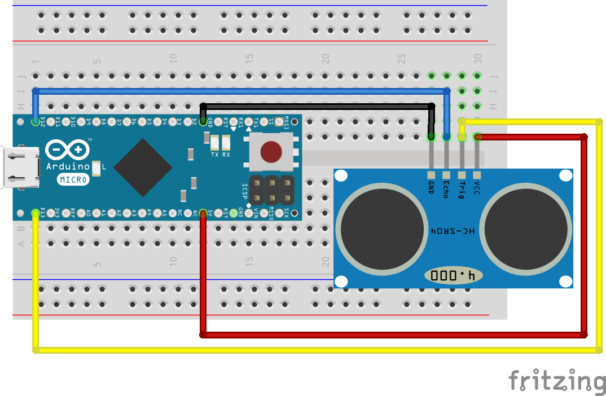

.. Copyright 2014 The Arobito Project
   
   Licensed under the Apache License, Version 2.0 (the "License");
   you may not use this file except in compliance with the License.
   You may obtain a copy of the License at
   
       http://www.apache.org/licenses/LICENSE-2.0
   
   Unless required by applicable law or agreed to in writing, software
   distributed under the License is distributed on an "AS IS" BASIS,
   WITHOUT WARRANTIES OR CONDITIONS OF ANY KIND, either express or implied.
   See the License for the specific language governing permissions and
   limitations under the License.

Ultrasonic distance measurement with HC-SR04
============================================

The HC-SR04 is a complete ultrasonic distance measurement device that is very simple to use and costs just about 3 EUR.
The detection range as written in the data sheet is between 2 cm to 4 m, but experiments show that 3 cm to 2 m is more
realistic.

Basic setup
-----------

The basic setup consists of only these parts:

- a half-length breadboard
- an Arduino Micro v3
- an HC-SR04 ultrasonic distance sensor
- a few wires

The HC-SR04 works simply by sending a pulse to the trigger input and waiting for a pulse from the echo output. The
length of this pulse allows the calculation of the distance to the detected object. We selected the Arduino pin 13 for
sending the trigger pulse and pin 12 for receiving the echo pulse.

The power is delivered over the USB connection of the Arduino.

Programming the Arduino
-----------------------

The code for this experiment can be found under `arobito/arobito-mcu/experiments/usonic/Basic_Distance_Measuring
<https://github.com/arobito/arobito-mcu/tree/master/experiments/usonic/Basic_Distance_Measuring>`_ as Atmel Studio
Project.

The definitions:

.. code:: c

   #define TRIGGER_PIN 13
   #define ECHO_PIN 12
   #define USONIC_DIV 58.0
   #define MEASURE_SAMPLE_DELAY 5
   #define MEASURE_SAMPLES 25
   #define MEASURE_DELAY 250

Trigger pin and echo pin are the two pins where the HC-SR04 is connected to. From the data sheet we know that we have to
divide the measured microseconds by 58 to get centimeters. We delay our sample measurements by 5 µs, and take 25 samples
to calculate the average. Between two measuring cycles the controller should wait for 1/4 second.

.. code:: c

   void setup()
   {
      // Serial monitoring
      Serial.begin(9600);
   
      // Initializing Trigger Output and Echo Input
      pinMode(TRIGGER_PIN, OUTPUT);
      pinMode(ECHO_PIN, INPUT);
   
      // Reset the trigger pin and wait a half a second
      digitalWrite(TRIGGER_PIN, LOW);
      delayMicroseconds(500);
   }

During setup, the serial (USB) port get initialized and the trigger and the echo pin get assigned. To make sure we have
a defined starting point, the trigger pin is put to low explicitly. After waiting half a second, the loop may start.

The loop simply triggers the measurement:

.. code:: c

   void loop()
   {
     delay(MEASURE_DELAY);
     long distance = measure();
     Serial.print("Distance: ");
     Serial.print(distance);
     Serial.println(" mm");
   }

The method ``measure()`` contains the sampling of single measurements:

.. code:: c

   long measure()
   {
     long measureSum = 0;
     for (int i = 0; i < MEASURE_SAMPLES; i++)
     {
       delay(MEASURE_SAMPLE_DELAY);
       measureSum += singleMeasurement();
     }
     return measureSum / MEASURE_SAMPLES;
   }

One single measurement sequence looks like the following:

.. code:: c

   long singleMeasurement()
   {
     long duration = 0;
     // Measure: Put up Trigger...
     digitalWrite(TRIGGER_PIN, HIGH);
     // ... wait for 11 µs ...
     delayMicroseconds(11);
     // ... put the trigger down ...
     digitalWrite(TRIGGER_PIN, LOW);
     // ... and wait for the echo ...
     duration = pulseIn(ECHO_PIN, HIGH);
     return (long) (((float) duration / USONIC_DIV) * 10.0);
   }

The programm's output looks like the following:

.. code:: text

   Distance: 90 mm
   Distance: 90 mm
   Distance: 89 mm
   Distance: 92 mm
   Distance: 90 mm
   Distance: 197 mm
   Distance: 207 mm
   Distance: 1371 mm
   Distance: 209 mm
   Distance: 159 mm
   Distance: 125 mm
   Distance: 125 mm
   Distance: 127 mm
   Distance: 128 mm
   Distance: 124 mm
   Distance: 124 mm
   Distance: 125 mm
   Distance: 126 mm

