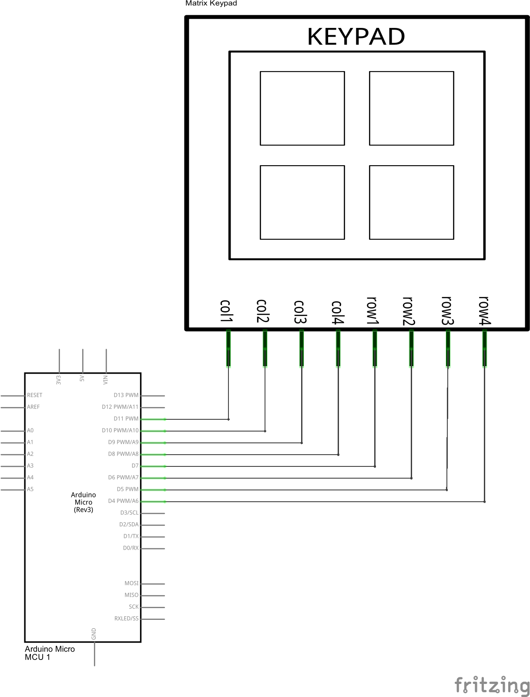
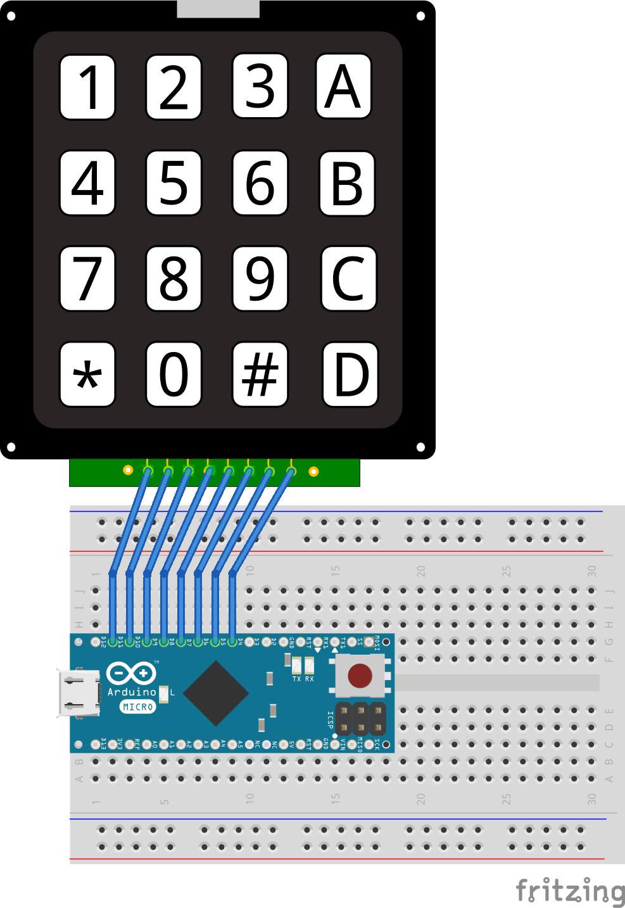

.. Copyright 2014 The Arobito Project
   
   Licensed under the Apache License, Version 2.0 (the "License");
   you may not use this file except in compliance with the License.
   You may obtain a copy of the License at
   
       http://www.apache.org/licenses/LICENSE-2.0
   
   Unless required by applicable law or agreed to in writing, software
   distributed under the License is distributed on an "AS IS" BASIS,
   WITHOUT WARRANTIES OR CONDITIONS OF ANY KIND, either express or implied.
   See the License for the specific language governing permissions and
   limitations under the License.

Using a Matrix Keypad
=====================

There a several cheap 4x4 matrix keypads available that can be easily controlled with an Arduino MCU. Those keypads
don't have own controllers. They are connected by their rows and columns. When putting one row to high, you can read at
the column lines which of the buttons are pressed in this row. We need to cycle through the rows and read the columns to
get all buttons that are pressed.

Basic setup
-----------

The basic setup consists of only these parts:

- a half-length breadboard
- an Arduino Micro v3
- a 4x4 membrane keypad 
- a few wires

The circuit is very easy. We can connect the keypad directly to the Arduino. No extra parts are required.

For the experiments, we put everything together on a breadboad.

The power is delivered over the USB connection of the Arduino. The keypad does not need a dedicated power source.

Programming the Arduino
-----------------------

